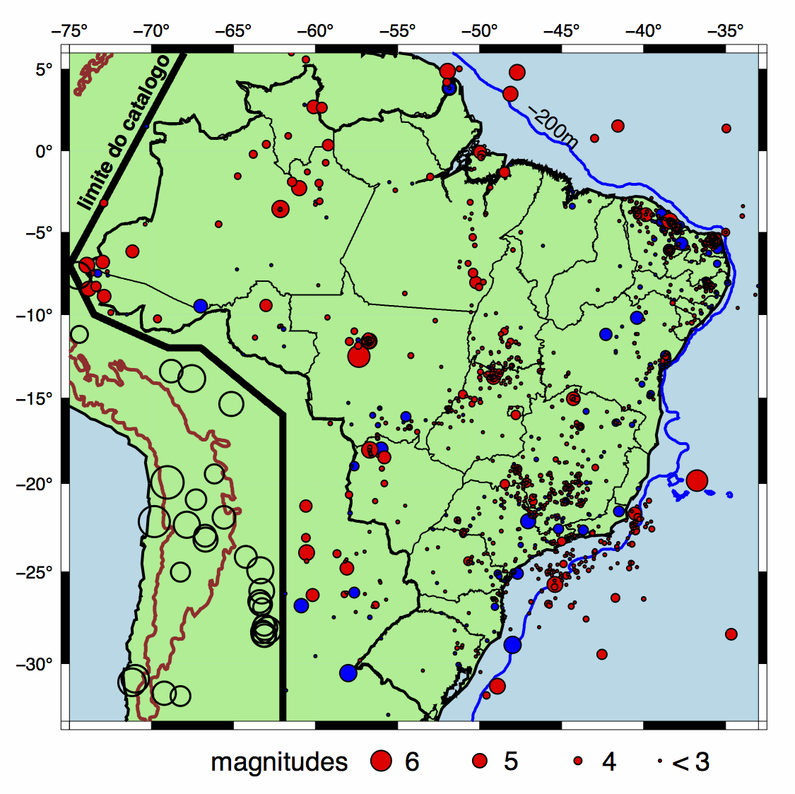

## Boletim Sísmico Brasileiro   Brazilian Seismic Bulletin

Este catálogo de sismos do Brasil é uma compilação de dados de várias
fontes. Para os sismos até 1981, usa-se o livro *Sismicidade do Brasil
(Berrocal et al., 1984)* com dados históricos e instrumentais baseados na
bibliografia da época e em pesquisas principalmente da USP, UFRN e UnB. 
De 1982 até 1995, usam-se os Boletins Sísmicos que eram publicados na
Revista Brasileira de Geofísica. Todos os dados do Catálogo Sísmico
Brasileiro foram obtidos através de colaboração entre todas as
instituições que estudam a sismicidade brasileira: USP, UnB, UFRN, IPT,
UNESP e ON.

A Fig. 1 mostra o mapa com os epicentros do Boletim Sísmico Brasileiro,
até **24/06/2014**. 

A listagem completa dos sismos, no formato CSV, é o arquivo **catalogue\_br\_CLEAN.csv**.

Este catálogo não inclui os sismos profundos do Acre, apenas os sismos
crustais no Brasil e vizinhanças. Também foram removidos do catálogo *bruto* os eventos de fora do
Brasil (“E”), os duvidosos (“D”), os de incerteza epicentral superior a
100km e magnitudes menores que 2.

*Fig. 1. Epicentros do Boletim Sísmico Brasileiro.*

## Legenda:

Campo  | Significado | Obs
------ | ----------- | ---
YEAR | Ano | 
MO | Mês | 
DD | Dia |
HH | Hora Universal | 
MI | Minuto | 
SECS | Segundos | Mesmo para os tremores antigos, antes da era instrumental, a Hora Local foi convertida para Hora UT (UT=Hora Local + 3 horas, ou Hora Local de Verão + 2 horas).
LATIT. | Latitude | 
LONGIT |  Longitude | 
DEPTH  | profundidade do hipocentro (km) | profundidade 0.0 significa que não há informação.
ERR  | Incerteza estimada do epicentro (km) | valor 0.0 significa que não há informação.
MAG | Magnitude na escala Richter | correspondente à magnitude de onda P (mb).
MT | método de cálculo da magnitude | -1 = magnitude não disponível (valor=0.0 significando que não há dados). 0 = magnitude de onda P com estações a distâncias telessísmicas (mb IASPEI). 1 = magnitude mR com estações regionais (Assumpção, 1983). 2 = média de mb e mR. 3 = magnitude estimada pela área afetada (Berrocal et al., 1984): `mag = 1.63  +  0.60 log (Area II, km2)` ou `mag = 2.29  +  0.55 log (Area IV, km2)` 4 = magnitude estimada com Intensidade máxima Io (sem Área afetada disponível): `mag = 1.21  +  0.45 Io` 5 = magnitude estimada indiretamente.
CAT | Categoria de evento | A = dados macrossísmicos detalhados para determinar o epicentro e isossistas. B = dados macrossísmicos suficientes para estimar epicentro e a área afetada total. C = dados macrossísmicos insuficientes para estimar área afetada.  D = dado duvidoso: dado equivocado, suspeita de erro, ou não é sismo natural. E = terremoto forte fora do Brasil, mas que foi sentido em uma ou mais cidades do país. I = dado instrumental.  Io =  Intensidade máxima epicentral, escala Mercalli Modificada
AFELT | Área total onde o sismo foi sentido| área da isossista II MM = [Area II]), em 10^3 km^2.
ST | Estado do Brasil, ou país | AR=Argentina, BO=Bolivia, PY=Paraguai, UR=Uruguai.
LOCALITY | nome da cidade mais próxima ao epicentro | 
(SOURCE) COMMENTS | Fonte primária dos dados () e comentários sobre o evento | Quando a fonte não é mencionada, trata-se de dado de Berrocal et al.(1984).

### ChangeLog:
Here is the [changelog](changelog.md) for all available versions. 

 Boletim Sismico Brasileiro de Centro de Sismologia-USP está licenciado com uma Licença <a rel="license" href="http://creativecommons.org/licenses/by/4.0/">Creative Commons - Atribuição 4.0 Internacional</a>.

